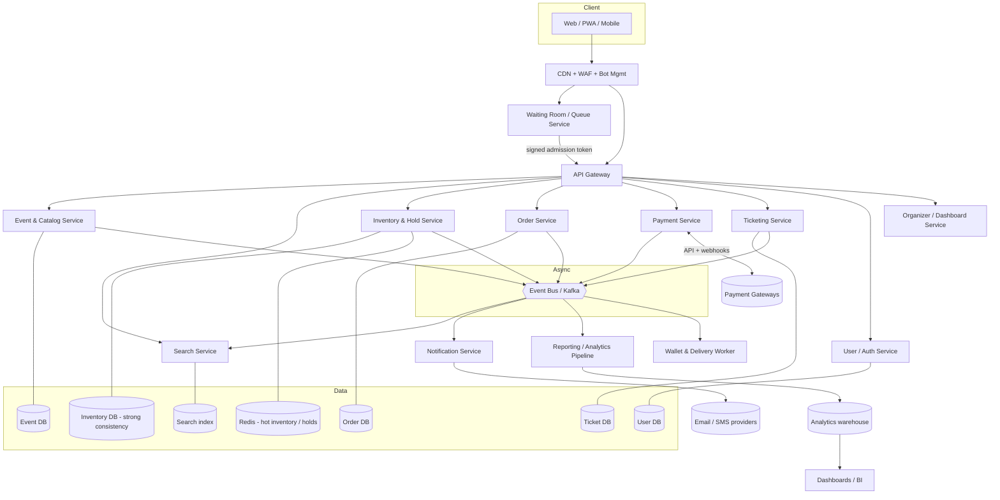
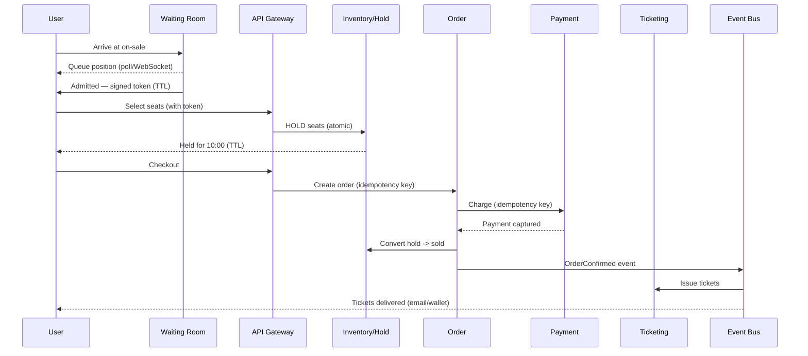

# 02 — System Architecture

## Architectural style

- **Microservices**, organized around business capabilities, communicating over
  a mix of synchronous (REST/gRPC) and asynchronous (event bus) calls.
- **Event-driven** core: state changes (seat held, order placed, payment
  captured, ticket issued) are published as events. This gives us an audit
  trail, decoupling, and easy feeds into reporting.
- **CQRS**: the write side (selling) and the read side (browsing, reporting)
  are separate models and separate data stores.
- **Edge-first load shedding**: CDN + waiting room absorb the spike so core
  services see only admitted, rate-limited traffic.

## High-level diagram

## Services (bounded contexts)

| Service | Responsibility | Consistency |
|---------|----------------|-------------|
| **User / Auth** | Registration, login, sessions, JWT, profiles, purchase-limit identity. | Strong |
| **Event & Catalog** | Events, venues, seat maps, ticket types, pricing, sales windows. | Strong (writes) / cached reads |
| **Search** | Denormalized read model for discovery & browse. | Eventual |
| **Waiting Room / Queue** | Admits users into the store at a controlled rate; issues signed tokens. | Own store (Redis) |
| **Inventory & Hold** | The heart: seat/GA availability, holds with TTL, reservation, no-oversell. | **Strong** |
| **Order** | Order lifecycle, saga orchestration, purchase-limit enforcement. | Strong |
| **Payment** | Gateway integration, idempotent charge/capture, webhooks, refunds. | Strong + idempotent |
| **Ticketing** | Ticket generation, secure QR/barcode, transfer, validation. | Strong |
| **Notification** | Email/SMS/push, wallet pass delivery. | Eventual (at-least-once) |
| **Organizer / Dashboard** | Event management UI + live sales views. | Reads from CQRS views |
| **Reporting / Analytics** | Streams events into a warehouse; serves reports. | Eventual |
| **Access Control** | Gate scanning, offline validation, reconciliation. | Local-first + sync |

## The write path (an on-sale, step by step)

## The read path (browsing)

Reads never touch the inventory write store directly. The storefront reads:

- **Static/semi-static** event content from the CDN (event pages, images, seat
  map SVGs) — cached aggressively.
- **Approximate availability** ("Available" / "Few left" / "Sold out") from a
  cached read model refreshed from the event bus — deliberately *not* exact, to
  avoid hammering the inventory store. Exact availability is only resolved at
  **hold time**, atomically.

This split is what lets millions browse while the strongly-consistent inventory
store only handles the much smaller admitted-and-committing flow.

## Why a waiting room is non-negotiable

Without it, an on-sale is an uncontrolled DDoS by your own customers. The
waiting room converts an unbounded spike into a **known, bounded arrival rate**
that you can capacity-plan for. It also:

- Gives fans a fair, transparent experience instead of random errors.
- Is the first line of **bot/scalper defense** (rate + identity + challenge).
- Lets you keep the inventory store within its safe throughput.

See [feature-flows/03 — Waiting Queue](feature-flows/03-waiting-queue.md).

## Deployment topology

- **Kubernetes** (AKS/EKS/GKE) with per-service horizontal pod autoscaling.
- **Multi-AZ** within a region; core transactional data replicated
  synchronously across AZs. Optional multi-region active-passive for DR.
- **Pre-scaling**: because on-sales are *scheduled*, autoscaling is combined
  with **scheduled scale-out** minutes before the on-sale, plus pre-warmed
  caches and connection pools.
- **Cell-based isolation for hot events** (optional): a very large on-sale can
  be pinned to dedicated inventory shards/partitions so one mega-event can't
  starve everyone else.

## Failure philosophy

- Every synchronous cross-service call has timeouts, retries with backoff,
  circuit breakers, and bulkheads.
- Every money/inventory operation is idempotent and driven by a **saga** with
  explicit compensation (release hold, refund) so partial failures self-heal.
- The system prefers to **fail a purchase safely** (release seats, no charge)
  over ever oversell or double-charge.
