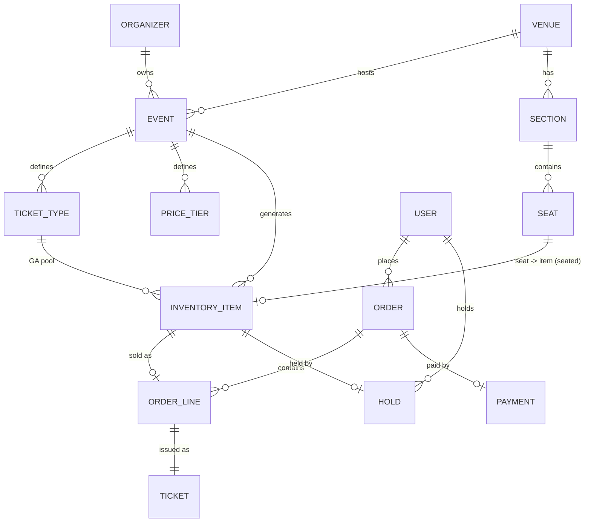

# 04 — Data Model

This is a logical model of the core domain. Each bounded context owns its own
tables/store; foreign keys shown across contexts are logical references (by ID),
not physical DB constraints across services.

## Core entities (ER overview)

## Key tables

### Event / Catalog context
- **organizer** — id, name, billing info, payout account, status.
- **venue** — id, name, address, geo, capacity, seat-map reference.
- **section** — id, venue_id, name, kind (seated/GA), row/seat layout.
- **seat** — id, section_id, row, number, accessibility flags, x/y for map.
- **event** — id, organizer_id, venue_id, title, description, starts_at,
  status (draft/published/on_sale/sold_out/cancelled/completed), sales windows.
- **ticket_type** — id, event_id, name (Adult/VIP/…), rules, max_per_order.
- **price_tier** — id, event_id, section_id/ticket_type_id, price, currency,
  fees, valid window (supports dynamic/tiered pricing).

### Inventory context
- **inventory_item** — id, event_id, seat_id (nullable for GA), ticket_type_id,
  price_tier_id, **status** (`available` | `held` | `sold` | `blocked`),
  version (optimistic lock). This is the durable system of record.
- **hold** — id, inventory_item_id, user_id, order_id (nullable),
  expires_at (TTL), created_at. Holds also live in Redis for speed; Postgres is
  the durable mirror.
- **inventory_ledger** — append-only log of every state transition
  (available→held→sold / →available on release). Enables audit + reconciliation.

Redis hot structures:
- `event:{id}:ga:{type}:available` — integer counter for GA (atomic `DECR`).
- `event:{id}:seat:{seatId}` — seat status + hold owner + TTL.
- Holds use Redis key TTL for automatic expiry, mirrored to a reaper that
  writes releases to the ledger.

### Order / Payment context
- **order** — id, user_id, event_id, status
  (`pending` | `awaiting_payment` | `confirmed` | `failed` | `cancelled` |
  `refunded`), total, currency, idempotency_key, created_at, expires_at.
- **order_line** — id, order_id, inventory_item_id, price, fees, taxes.
- **payment** — id, order_id, psp, psp_intent_id, idempotency_key,
  status (`initiated`|`captured`|`failed`|`refunded`), amount, created_at.
- **refund** — id, payment_id, amount, reason, status.

### Ticketing context
- **ticket** — id, order_line_id, event_id, holder info, **secure_token**
  (rotating), barcode/QR payload, status (`valid`|`used`|`transferred`|
  `revoked`), issued_at.
- **ticket_scan** — id, ticket_id, gate, scanned_at, result, device_id.
- **transfer** — id, ticket_id, from_user, to_user, status.

### User / Auth context
- **user** — id, email, phone, hashed_credentials (or IdP subject), profile,
  verification status.
- **purchase_limit_counter** — (user_id, event_id) → count, enforced during
  order creation.

## Consistency notes

- **Inventory** is the only place strong consistency is absolute. The write
  path uses Redis atomics for speed + Postgres as durable truth, reconciled via
  the ledger. A background reconciler detects and repairs any Redis↔Postgres
  drift (Redis is a cache, Postgres wins).
- **Search** and **availability displays** are read models rebuilt from the
  event bus — eventually consistent by design.
- **Reporting** consumes the same event stream into the analytics warehouse.

## Identifiers & idempotency

- All IDs are UU/ULID (sortable) to avoid hot-partitioning and enable
  client-generated idempotency keys.
- **Idempotency keys** are first-class on `order` and `payment` so any retry
  (network, user double-click, gateway webhook replay) is safe.
