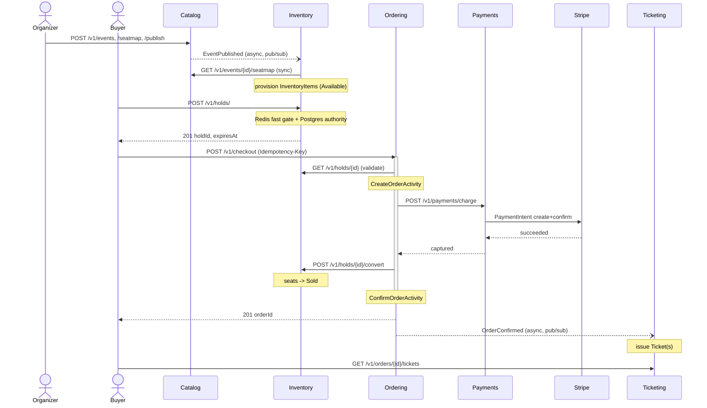

# Data Flow & Service Boundaries

Reference for how the five EventPlatform services divide responsibility and talk
to each other — grounded in the actual code, not the original design docs (see
[docs/design/](design/) for the pre-implementation architecture). Updated
2026‑07‑26, branch `claude/enterprise-ticket-platform-w3opb0`.

## Service boundaries

Each service owns one Postgres schema and never reads another's tables — only
through its HTTP API (sync) or its published events (async). Dapr app-ids are
the lowercase names below.

| Service (app-id) | Owns (DB `catalog` etc.) | Public API | Publishes | Consumes |
|---|---|---|---|---|
| `catalog` | `Event`, `SeatMap`, `Seat` | `POST /v1/events` · `GET /v1/events` (anonymous; published-only unless the caller's tenant owns the event) · `GET /v1/events/{id}` (anonymous, same visibility rule) · `POST /v1/events/{id}/seatmap` · `GET /v1/events/{id}/seatmap` (anonymous, same visibility rule) · `POST /v1/events/{id}/publish` | `EventPublished` | — |
| `inventory` | `InventoryItem`, `Hold`, `HoldItem`, `LedgerEntry` (+ Redis fast gate) | `GET /v1/events/{id}/inventory` · `POST /v1/events/{id}/inventory/block` · `POST /v1/events/{id}/inventory/unblock` · `POST /v1/holds/` · `GET`/`DELETE /v1/holds/{id}` | `SeatHeld`, `SeatReleased`, `SeatSold`, `SeatBlocked`, `SeatUnblocked` | `EventPublished` |
| `ordering` | `Order`, `OrderLine` (+ Dapr Workflow state) | `POST /v1/checkout` · `GET /v1/orders/{id}` | `OrderConfirmed` | — |
| `payments` | `Payment`, `ProcessedWebhookEvent` | `POST /v1/payments/webhooks/stripe` (public, signature-verified) | `PaymentCaptured`, `PaymentFailed`, `PaymentRefunded` | — |
| `ticketing` | `Ticket` | `GET /v1/orders/{id}/tickets` · `GET /v1/tickets/{id}` | `TicketIssued` | `OrderConfirmed` |

`inventory`'s `POST /v1/holds/{id}/convert` and `/release`, and `payments`'s
`POST /v1/payments/charge` and `/refund`, are also HTTP endpoints but internal —
called only by `ordering`'s checkout saga, not exposed to buyers.

**Not yet consumed:** `SeatHeld`, `SeatReleased`, `SeatSold`, `SeatBlocked`, `SeatUnblocked`, `PaymentCaptured`,
`PaymentFailed`, `PaymentRefunded`, and `TicketIssued` are published today with
no subscriber wired up — they're there for future consumers (notifications,
read models, analytics) without any code change on the publishing side.

## How services talk — the communication matrix

| Mechanism | Protocol (actual hops) | Used for | Guarantee |
|---|---|---|---|
| **Sync, buyer/organizer-facing** | Plain HTTP/JSON (Minimal APIs, Scalar-documented) | Every `/v1/...` endpoint above | Request/response |
| **Sync, service-to-service** (Dapr *service invocation*) | App → local sidecar (HTTP or gRPC depending on client) → **gRPC** sidecar-to-sidecar (fixed Dapr internal) → remote sidecar → remote app (HTTP) | `inventory`→`catalog` (read seat map while provisioning); `ordering`→`inventory` (validate/convert/release hold); `ordering`→`payments` (charge/refund) | Synchronous; caller decides success/failure per response |
| **Async, event-driven** (Dapr *pub/sub*, outbox-backed) | Outbox row → `OutboxRelay` polls (2s) → Dapr pub/sub (Redis locally, Service Bus in Azure — same component name, zero code change) → subscriber's topic endpoint | `catalog`→`EventPublished`→`inventory`; `ordering`→`OrderConfirmed`→`ticketing` | At-least-once; outbox row id = CloudEvent id, so subscribers dedupe |
| **Direct** (bypasses Dapr entirely) | `StackExchange.Redis` straight to Redis | `inventory`'s Lua atomic hold check-and-set — the actual flash-sale hot path | Sub-millisecond; this is *why* it skips the sidecar |
| **External** | HTTPS, direct SDK / signed webhook | `payments`→Stripe (Stripe.net, outbound charge/refund); Stripe→`payments` (inbound webhook, `Stripe-Signature` verified) | Stripe's own idempotency (charge) + our dedupe ledger (webhook) |
| **Workflow durability** | Dapr Workflow (Durable Task Framework) — state in Dapr's actor store (Redis-backed locally) | `ordering`'s `CheckoutWorkflow` | Survives a crash mid-saga; resumes exactly where it left off |
| **Auth propagation** | JWT bearer (OIDC in prod / dev HS256 locally) validated per-service | Every request | `tenant_id` + `sub` claims → scoped `ITenantContext`; never trusted from the request body |

**On the gRPC question specifically:** none of our own services expose a gRPC
endpoint — every public/internal API is HTTP/JSON. gRPC only appears *inside*
the Dapr layer: the Dapr .NET SDK's `DaprClient` talks gRPC to its own sidecar
by default (used for pub/sub publish and by `DaprSeatMapClient`'s
`InvokeMethodAsync`), the Workflow SDK does the same, and — regardless of which
client API an app uses — the hop *between* two sidecars for service invocation
is always gRPC internally. `DaprHoldClient`/`DaprPaymentClient` use
`DaprClient.CreateInvokeHttpClient` instead, which keeps the *local* app→sidecar
leg HTTP; the sidecar→sidecar leg is gRPC either way.

## The full purchase flow

Step by step, with the exact mechanism at each hop:

1. **Create event** — `POST /v1/events` (Catalog). New `Event` in `Draft`.
2. **Define seat map** — `POST /v1/events/{id}/seatmap` (Catalog). Generates `Seat` rows.
3. **Publish** — `POST /v1/events/{id}/publish` (Catalog). `Draft` → `Published`, writes `EventPublished` to the outbox **in the same DB transaction** — no dual-write.
4. **Relay** — Catalog's `OutboxRelay` (2s poll) publishes `EventPublished` to the `pubsub` component.
5. **Provision** — Inventory's subscription (`POST /integration/catalog/event-published`) receives it (idempotency-checked), calls Catalog's seat map **synchronously** via Dapr service invocation, and creates one `InventoryItem` per seat (`Available`).
6. **Hold** — `POST /v1/holds/` (Inventory). Redis Lua atomic check-and-set (**direct**, the fast gate) → Postgres optimistic-concurrency write (the authority) marks seats `Held` with a TTL → `SeatHeld` to the outbox.
7. **Checkout** — `POST /v1/checkout` (Ordering) with an `Idempotency-Key` header schedules a `CheckoutWorkflow` instance (Dapr Workflow):
   - `FetchHoldActivity` — `GET /v1/holds/{id}` on Inventory (sync), validates owner/active/not-expired.
   - `CreateOrderActivity` — creates the `Order` (idempotent: tolerates a concurrent duplicate via `TrySaveChangesAsync`).
   - `ChargeActivity` — `POST /v1/payments/charge` on Payments (sync); Payments calls Stripe (or the dev simulator), records the `Payment`, emits `PaymentCaptured`/`PaymentFailed`.
   - `ConvertActivity` — `POST /v1/holds/{id}/convert` on Inventory (sync); seats → `Sold` (Postgres authority + Redis marker), emits `SeatSold`.
   - `ConfirmOrderActivity` — `Order` → `Confirmed`, emits `OrderConfirmed`.
   - **On failure at any step:** compensations run — `FailOrderActivity`, `RefundActivity`, `ReleaseHoldActivity` — and the workflow returns the matching outcome (`PaymentFailed`, `ConvertFailed`, …) instead of `Confirmed`.
8. **Relay** — Ordering's `OutboxRelay` publishes `OrderConfirmed`.
9. **Issue tickets** — Ticketing's subscription (`POST /integration/ordering/order-confirmed`) issues one `Ticket` per sold seat (idempotent — unique index on `(order, seat)`), emits `TicketIssued`.
10. **Fetch** — `GET /v1/orders/{id}/tickets` (Ticketing).

## Background processes (every service where relevant)

| Process | Service | What it does |
|---|---|---|
| `OutboxRelay` | all five | Polls the outbox every 2s, publishes pending rows to Dapr pub/sub, marks them published only after Dapr accepts — a crash mid-batch just re-publishes next tick |
| `ExpiredHoldReaper` | Inventory | Reclaims holds past their TTL: releases seats to `Available` in Postgres (authority), clears the Redis keys, emits `SeatReleased` |
| `InventoryReconciler` | Inventory | Detects a flushed/restarted Redis via a sentinel key and rebuilds the fast gate from Postgres (held + sold seats). Only ever *adds* restrictions, never frees a seat — can't itself cause oversell |

## See also

- [local-e2e-walkthrough.md](local-e2e-walkthrough.md) — run this exact flow locally
- [design/lld-phase1-seated.md](design/lld-phase1-seated.md) — the pre-implementation low-level design
- [adr/0010-messaging-and-sagas.md](adr/0010-messaging-and-sagas.md) — why outbox + Dapr Workflow
