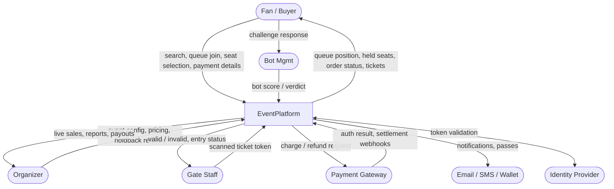
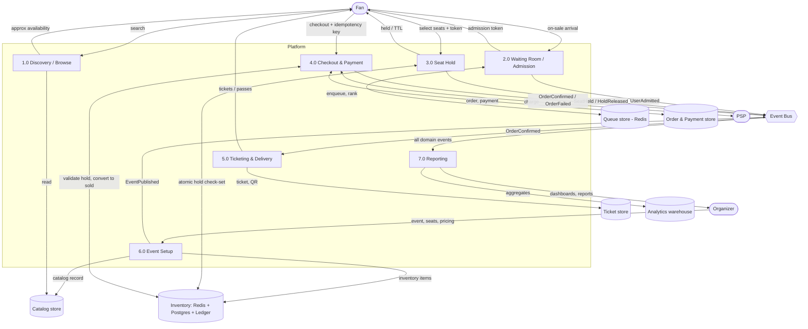
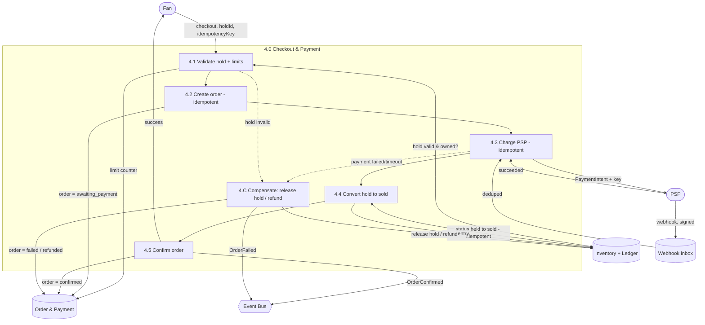
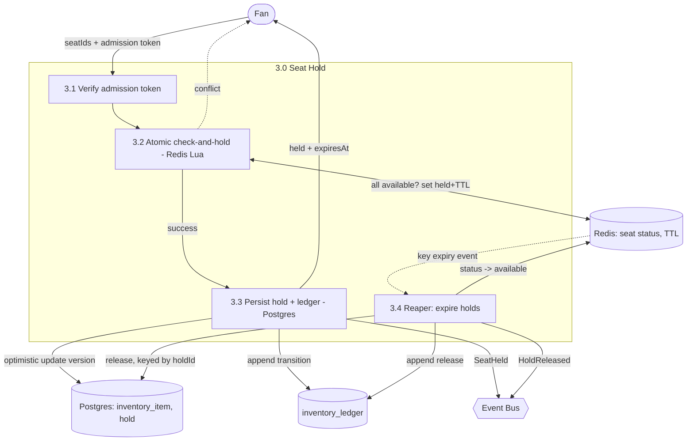
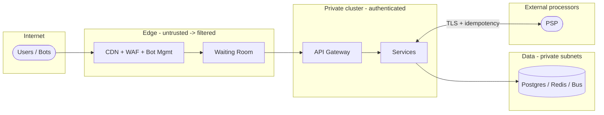

# Data Flow Diagrams (DFD)

**System:** EventPlatform
**Related:** [HLD](hld.md), [LLD (Phase 1)](lld-phase1-seated.md)

DFDs describe how **data moves** between external entities, processes, and data
stores. Notation used here (rendered with Mermaid):

- **External entity** — rounded/stadium node `([ ])`
- **Process** — rectangle `[ ]`
- **Data store** — cylinder `[( )]`
- **Data flow** — arrow, labelled with the data in motion
- **Trust boundary** — subgraph box

---

## Level 0 — Context diagram

The whole platform as a single process, showing external actors and systems and
the data crossing the boundary.

## Level 1 — Major processes

Decomposes the platform into its principal processes and the data stores they
read/write. This is the system's data-flow backbone.

Notes:
- **Reads (1.0)** touch only cached catalog + read models — never the inventory
  write store.
- **The bus** decouples producers from read-side consumers (Search, Reporting,
  Ticketing, Notification).
- **Exact availability** is only ever resolved inside **3.0 Seat Hold**,
  atomically.

## Level 2 — Drill-down: Checkout & Payment (process 4.0)

The riskiest flow, expanded. Shows idempotency keys, the hold conversion, and
the compensation path. (Sequenced step-by-step in the [LLD](lld-phase1-seated.md).)

## Level 2 — Drill-down: Seat Hold (process 3.0)

## Data store catalog

| Store | Owner | Contents | Consistency |
|-------|-------|----------|-------------|
| Catalog store | Catalog | events, venues, seat maps, pricing | Strong (writes), cached reads |
| Queue store (Redis) | Waiting Room | queue sorted-sets, admission tokens | Ephemeral |
| Inventory (Redis) | Inventory | hot seat/GA status, holds w/ TTL | Strong, atomic |
| Inventory (Postgres) | Inventory | durable inventory_item, hold | Strong (system of record) |
| inventory_ledger | Inventory | append-only state transitions | Strong, immutable |
| Order & Payment store | Order/Payment | orders, order_lines, payments, refunds | Strong, ACID |
| Webhook inbox | Payment | raw PSP events, deduped | Strong |
| Ticket store | Ticketing | tickets, scans, transfers | Strong |
| Analytics warehouse | Reporting | aggregates, historical | Eventual (OLAP) |
| Event log (Hubs/Kafka) | Platform | retained domain events | Durable, replayable |

## Trust boundaries

- Card data **never** enters AppZone/DataZone — it goes browser → PSP directly
  (PCI SAQ-A).
- `tenant_id` is only trusted from a validated JWT at the gateway, never from
  request bodies.
- DataZone is reachable only from AppZone (private subnets, no public ingress).
