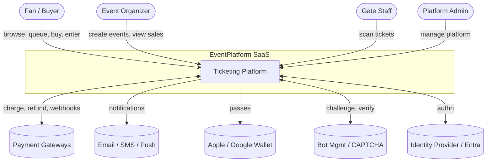
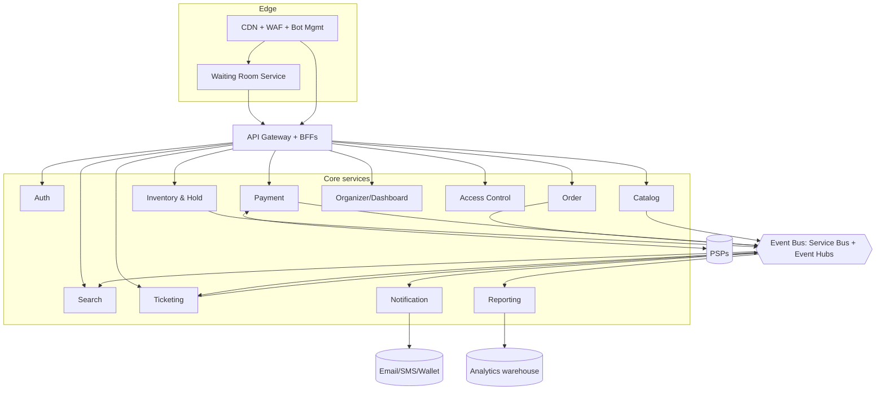
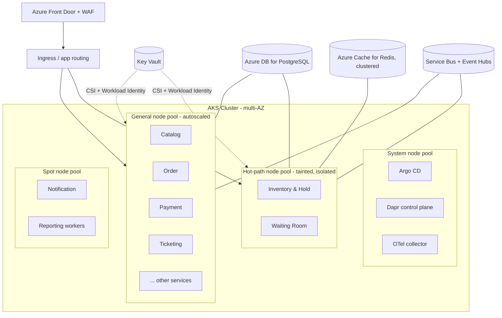

# High-Level Design (HLD)

**System:** EventPlatform — Enterprise Ticketing Platform
**Status:** Baseline for build
**Related:** [ADRs](../adr/), [02 — Architecture](../02-architecture.md), [DFD](dfd.md)

This HLD consolidates the architecture and the locked ADR decisions into one
reference. It describes *what* the system is made of, *how* the pieces fit, and
*where* they run — without dropping to class-level detail (that's the
[LLD](lld-phase1-seated.md)).

---

## 1. Purpose & scope

A multi-tenant SaaS that lets organizers sell tickets to high-demand live events
and lets fans buy them fairly and reliably under flash-sale load. Scope covers
the full path: event setup → discovery → waiting room → seat hold → checkout →
payment → ticket issuance → gate entry, plus organizer dashboards, reporting,
and third-party integrations.

## 2. Architecture drivers (the forces shaping everything)

| Driver | Implication |
|--------|-------------|
| Extreme, scheduled spikes | Edge load-shedding + waiting room + pre-scaling |
| Zero oversell (hard invariant) | Strongly-consistent inventory core; atomic holds |
| Zero double-charge | Payment saga + idempotency everywhere |
| Fairness vs bots | Waiting room + bot management + purchase limits |
| Multi-tenant, noisy-neighbor | Hybrid tenancy + AKS cell isolation |
| Independent evolution | Microservices, event-driven, monorepo |

## 3. System context (C4 Level 1)

## 4. Component view (C4 Level 2)

The platform is a set of independently-deployable services behind an edge and a
gateway. Reads are cached/CDN-fronted; writes flow through the strongly-
consistent core; everything emits events for the async fabric.

## 5. Component responsibilities & interfaces

| Service | Responsibility | Sync API | Publishes | Subscribes | Store |
|---------|----------------|----------|-----------|------------|-------|
| **Auth** | Identity, JWT (tenant claim), sessions | REST/OIDC | `UserRegistered` | — | PostgreSQL |
| **Catalog** | Events, venues, seat maps, pricing, sales windows | REST/gRPC | `EventPublished`, `EventUpdated` | — | PostgreSQL |
| **Search** | Discovery read model | REST | — | catalog + inventory events | OpenSearch |
| **Waiting Room** | Queue + admission tokens | REST/WS | `UserAdmitted` | — | Redis |
| **Inventory & Hold** | Availability, atomic holds, no-oversell | gRPC/REST | `SeatHeld`, `HoldReleased`, `SeatSold` | — | Redis + PostgreSQL |
| **Order** | Order lifecycle, saga orchestration, limits | REST | `OrderCreated`, `OrderConfirmed`, `OrderFailed` | `PaymentCaptured/Failed` | PostgreSQL |
| **Payment** | PSP integration, idempotent charge, webhooks, refunds | REST | `PaymentCaptured`, `PaymentFailed`, `Refunded` | `OrderCreated` | PostgreSQL |
| **Ticketing** | Ticket generation, secure QR, transfer | REST | `TicketIssued`, `TicketTransferred` | `OrderConfirmed` | PostgreSQL + Blob |
| **Notification** | Email/SMS/push, wallet passes | — | — | many events | (stateless + Redis) |
| **Organizer/Dashboard** | Event mgmt UI, live sales | REST | `HoldbackReleased`, `SalesPaused` | reporting views | PostgreSQL |
| **Reporting** | Streaming + historical analytics | REST | — | all domain events | ClickHouse/Synapse |
| **Access Control** | Gate scanning, offline validation | REST | `TicketScanned` | `TicketIssued` | PostgreSQL + local cache |

Interaction rules (from ADR-0008 / ADR-0010):
- No service reads another service's database. Only APIs or events.
- Sync calls only when an answer is needed now (e.g., Order → Inventory
  "validate hold"). Everything else is async over the bus.
- Every event-emitting service uses the **transactional outbox**.

## 6. Deployment architecture (AKS)

Key points:
- **Node pools** map to workload character: system, general (autoscaled),
  **dedicated hot-path** (tainted — Inventory + Waiting Room isolated so a mega
  on-sale can't starve others, per ADR-0011), and spot (cheap async workers).
- **Each service = a Dapr-annotated Deployment** with its own HPA/KEDA scaler.
- **GitOps**: Argo CD reconciles from the monorepo `deploy/` tree; CI never
  touches the cluster (ADR-0004).
- **Secrets** via Key Vault CSI + Workload Identity — none stored in-cluster.
- **Multi-AZ**; PostgreSQL zone-redundant; Redis clustered.

### Cell isolation for whales
A promoted event gets a **dedicated Redis shard + inventory DB partition +
scheduling onto the hot-path pool** (or a per-event node pool for the very
largest). Promotion is config, not code (ADR-0011).

## 7. Data architecture

- **Database-per-service** (ADR-0008). No shared schema.
- **Inventory** is the only absolute-strong-consistency store: Redis (fast gate)
  + PostgreSQL (durable truth) + append-only ledger, reconciled.
- **CQRS**: Search, Reporting, and dashboard views are read models fed by the
  event bus — eventually consistent by design.
- **Event log** (Event Hubs / Kafka API, retained) is the replayable audit
  trail and the feed for all read models.

See [04 — Data Model](../04-data-model.md) and the [LLD](lld-phase1-seated.md).

## 8. Cross-cutting concerns

| Concern | Approach |
|---------|----------|
| **Multi-tenancy** | `tenant_id` in JWT claim → propagated to every call/event/query; Postgres RLS; hybrid pooled + cell isolation (ADR-0011) |
| **Security** | OIDC/Entra, RBAC, mTLS in-mesh, WAF + bot mgmt, PCI SAQ-A, Key Vault + Workload Identity (see [06](../06-security-and-compliance.md)) |
| **Resilience** | Timeouts, retries w/ jittered backoff, circuit breakers, bulkheads, saga compensation, PSP failover |
| **Observability** | OpenTelemetry traces/metrics/logs, war-room dashboards, correlation IDs from edge inward (see [07](../07-observability.md)) |
| **Idempotency** | Client + PSP keys on order/payment; idempotent state transitions; webhook inbox |
| **Config & flags** | Externalized config; feature flags (OpenFeature) for progressive rollout |
| **Delivery** | Path-filtered CI (GitHub Actions) + GitOps CD (Argo CD) + Argo Rollouts canary |

## 9. Key runtime scenarios

These are detailed as flows in the [DFD](dfd.md) and sequenced in the
[LLD](lld-phase1-seated.md):

1. **Browse** — cached read path, no core write load.
2. **On-sale admission** — waiting room throttles arrivals into the store.
3. **Seat hold** — atomic, no-oversell (the critical section).
4. **Checkout saga** — order → payment → convert-to-sold, with compensation.
5. **Fulfilment** — async ticket issue + delivery.
6. **Reporting** — event stream → read models, never touches write path.

## 10. Non-functional targets

Restated from [01 — Requirements](../01-requirements.md): 0 oversell, 0
double-charge, 99.95%+ on-sale availability, checkout p99 < 2s (post-admission),
hold op p99 < 100ms, RTO < 15m / RPO < 1m.
