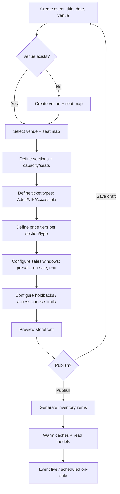

# Feature 1 — Event Creation & Organizer Dashboard

## Goal

Give organizers a self-service way to model an event exactly (venue, seat map,
ticket types, pricing, sale windows), publish it, and then watch it sell in real
time — with the controls they need mid-sale (pause sales, release held-back
inventory, adjust pricing).

## Event creation flow

## What "Publish" does under the hood

Publishing is the moment the abstract config becomes concrete, sellable
inventory. It:

1. **Generates `inventory_item` rows** — one per seat (seated) or a counted pool
   (GA), each tied to its ticket type and price tier, status `available`.
2. **Seeds the Redis hot structures** (GA counters, seat status keys).
3. **Builds the read model / search index** entry for discovery.
4. **Publishes an `EventPublished` event** so downstream (search, reporting)
   picks it up.
5. For scheduled on-sales, registers the on-sale with the **pre-scaling**
   system so capacity and caches are warmed minutes ahead.

Generating potentially 60,000+ inventory items is done as a background job with
progress feedback, not synchronously in the request.

## Dashboard capabilities

### Setup & configuration
- Visual **seat-map editor** (sections, rows, seats, accessibility, holds).
- Ticket types, pricing tiers, dynamic pricing rules.
- Sales windows, presale access codes, per-user purchase limits.
- **Holdbacks**: reserve inventory (artist/venue/promoter allocations) that can
  be released to public sale later.

### Live on-sale controls ("war room")
- **Pause / resume** sales instantly.
- **Release holdbacks** into public availability mid-sale.
- Adjust the **queue admission rate**.
- Block/flag suspicious buyers.
- View real-time sell-through (see [Reporting](05-reporting.md)).

### Post-sale
- Manage refunds, transfers, reschedules, cancellations.
- Payout reconciliation & financial reports.
- Attendee list & check-in stats.

## Design notes

- The dashboard's live views read from **CQRS read models / the analytics
  stream**, never by querying the hot inventory store directly — so an
  organizer refreshing dashboards can never slow down an on-sale.
- Config changes to a **live** event are tightly guarded and audited; some
  changes (e.g., reducing capacity below sold) are simply disallowed to protect
  invariants.
- All organizer actions are permission-checked (RBAC) and written to an audit
  log.

## Recommended additions

- **Templates**: clone a previous event / tour date to speed multi-date setup.
- **Multi-date tours**: model a tour with shared artist/pricing and per-date
  inventory.
- **Approval workflow** for large organizers (maker/checker before publish).
