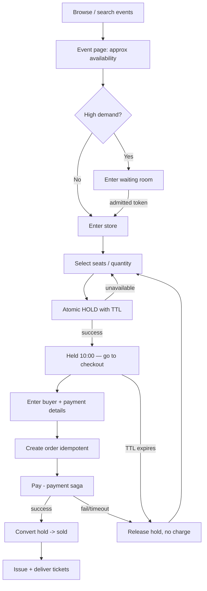

# Feature 2 — Ticket Selling (Browse → Hold → Checkout)

This is the buyer's core journey and the most concurrency-sensitive part of the
system. The guiding rule: **the exact-availability decision happens exactly
once, atomically, at hold time** — everything before it is approximate and
cached; everything after it is a durable, idempotent transaction.

## End-to-end buyer journey

## Step 1 — Browse (read path, cached)

- Event pages, seat-map SVGs, and pricing come from the **CDN + read model**.
- Availability shown is **approximate** ("Available" / "Limited" / "Sold out"),
  refreshed from the event bus. We deliberately do **not** show exact counts
  from the live inventory store to browsers — that would be a self-inflicted
  load bomb and it's stale the instant it renders anyway.

## Step 2 — Select & HOLD (the critical section)

This is where correctness is won or lost. A **hold** temporarily removes
inventory from the available pool for one user, for a fixed TTL (e.g., 10 min),
so they can pay without the seat vanishing — while guaranteeing no one else can
take it, and guaranteeing it comes back if they don't complete.

### GA (general admission) holds
- Redis `DECRBY` on `event:{id}:ga:{type}:available`.
- If the result is `>= 0`, the hold succeeds; a hold record with TTL is created.
- If it goes negative, we `INCRBY` back and return "sold out" — atomic, no
  oversell, no lock.

### Seated holds
- A Lua script (atomic in Redis) checks each requested seat's status and, only
  if **all** are `available`, flips them to `held` with the user + TTL. Partial
  failures flip nothing (all-or-nothing).
- The durable mirror in Postgres uses **optimistic concurrency** (version
  column) or `SELECT ... FOR UPDATE` on the specific rows as the system of
  record; Redis is the fast gate, Postgres is the truth, and the ledger records
  the transition.

### Why holds + TTL (not "add to cart then check at pay")
"Check availability only at payment" causes the classic failure: two people pay
for the same seat, and one gets a nasty surprise (or you oversell). Holding at
selection time makes the contested decision happen **once**, up front, and
gives the buyer a guaranteed window to pay.

### Hold expiry
- Redis key TTL expires the hold automatically.
- A **reaper** process listens for expirations (Redis keyspace notifications /
  scheduled sweep), returns the inventory to `available`, and writes the release
  to the ledger — exactly once (idempotent release keyed by hold id).

## Step 3 — Checkout & order

- The client sends a **client-generated idempotency key** with the create-order
  request, so a double-click / retry never creates two orders.
- Order service **re-validates the hold** belongs to this user and hasn't
  expired, enforces the **per-user purchase limit** (atomic counter per
  user+event), then creates a `pending` order and kicks off the
  [payment saga](06-payments.md).

## Step 4 — Payment → confirm

- On payment success: **convert hold → sold** (atomic, idempotent), mark order
  `confirmed`, emit `OrderConfirmed`.
- On failure/timeout/expiry: **release the hold**, mark order `failed`, ensure
  **no charge** stuck (payment saga guarantees this).

## Step 5 — Fulfilment

- `OrderConfirmed` triggers the [Ticketing service](../02-architecture.md) to
  generate tickets and the notification/wallet workers to deliver them —
  asynchronously, at-least-once, so delivery never blocks the checkout response.

## Concurrency guarantees (summary)

| Risk | Mitigation |
|------|------------|
| Two users take the same seat | Atomic Redis Lua check-and-set + Postgres optimistic lock; all-or-nothing. |
| GA oversell | Atomic `DECRBY` with revert-if-negative. |
| Buyer double-submits | Idempotency keys on order + payment. |
| Buyer exceeds limit via multiple tabs | Atomic per-user+event counter checked at order creation. |
| Held seats leak (never released) | TTL + reaper + ledger, idempotent release keyed by hold id. |
| Redis ↔ Postgres drift | Postgres is source of truth; background reconciler repairs Redis. |

## Recommended additions

- **Best-available auto-pick** for GA-like seated events (system picks the best
  N adjacent seats) — reduces map contention and speeds checkout.
- **Seat-lock visual feedback**: show seats greying out in near-real-time (best
  effort) to reduce failed hold attempts.
- **Abandoned-cart release metrics** to tune the TTL length per event.
