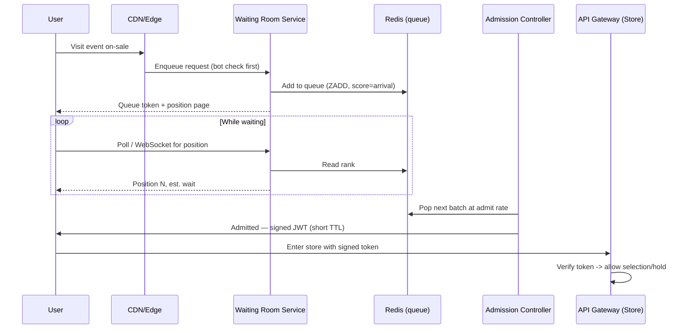

# Feature 3 — Virtual Waiting Queue (Waiting Room)

## Why it exists

At on-sale time, demand can be 10–100× capacity. If everyone hits the store at
once, three bad things happen: the backend melts, the experience is a random
lottery of errors, and bots win. The waiting room converts that unbounded spike
into a **controlled, fair, bounded arrival rate** into the store — it's both a
load-shedding mechanism and a fairness/anti-bot mechanism.

## How it works

## Queue mechanics

- **Data structure:** a Redis **sorted set** per event (`queue:{eventId}`),
  scored by arrival time (FIFO) — or by a random score assigned at open, if the
  organizer chooses "random-at-open" fairness (everyone who's there at T0 gets a
  random position, which defeats the "fastest bot wins" dynamic).
- **Token:** on entry, the user gets an opaque queue token bound to their
  identity/session (and a device/bot signal). Position is `ZRANK`.
- **Admission controller:** a controlled loop pops the front of the queue at a
  **configurable rate** (e.g., N users / 10s) — the rate is tuned to what the
  inventory store and checkout can safely absorb. Admitted users receive a
  **short-lived signed JWT** ("golden ticket") that the store's API gateway
  verifies.
- **Admission TTL & re-queue:** the golden ticket expires (e.g., 10–15 min). If
  a user is admitted but idle/abandons, their slot frees up. Abuse (sharing
  tokens, scripted behavior) → invalidate and re-queue or block.

## Fairness & anti-abuse

- **Bot filtering at the edge first** (WAF + bot management + optional
  CAPTCHA/challenge) so bots are thinned *before* they even take a queue slot.
- **One active queue position per identity/device**; detect and collapse
  duplicates.
- **Randomized start** option so refresh-spamming and low-latency bots gain no
  advantage.
- **Signed, single-use-ish admission tokens** bound to session — can't be
  resold/shared to jump the queue.
- Rate limits and anomaly detection feed the fraud system.

## User experience

- A branded waiting-room page with **live position and estimated wait**.
- Clear messaging: "You're in line. Don't refresh — it won't help and you won't
  lose your place." (Refresh-safety is essential to prevent panic behavior.)
- Real-time updates via **WebSocket** where possible, with polling fallback.
- Graceful "sold out while you waited" handling.

## Scaling the waiting room itself

- The waiting-room service must scale **higher** than the store, because it
  holds everyone. It is deliberately lightweight: enqueue, rank, admit — backed
  by Redis, mostly O(log n) ops, and heavily edge-cached static assets.
- The position page and its assets are served from the **CDN**; only the small
  position lookups hit the service.
- Because the store is protected behind admission, the store's autoscaling
  target is the **admit rate**, not raw arrival — a much smaller, predictable
  number.

## Buy vs build

- **Buy for v1:** Cloudflare Waiting Room, Queue-it, or Akamai give you a
  battle-tested waiting room in days and offload the riskiest scaling problem.
- **Build later** (this design) if you need deep control, custom fairness rules,
  or the economics flip at high volume.

## Config knobs (per event)

| Knob | Purpose |
|------|---------|
| Fairness mode | FIFO vs random-at-open |
| Admit rate | Users admitted per interval (throttle to backend capacity) |
| Golden-ticket TTL | How long an admitted user has before losing their slot |
| Max queue size | Optional cap → overflow "try later" page |
| Bot challenge level | Off / passive / CAPTCHA / hard challenge |
