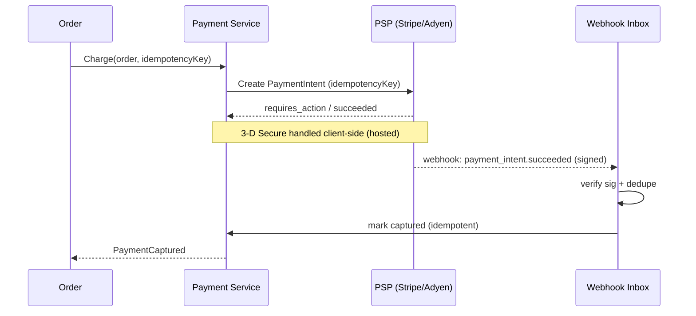

# Feature 4 — Third-Party Integrations

The platform depends on external services for payments, messaging, wallets, bot
defense, and partner connectivity. Every integration follows the same
principles so one flaky vendor can't take down an on-sale.

## Integration catalog

| Category | Providers (examples) | Used by |
|----------|----------------------|---------|
| **Payments** | Stripe, Adyen, Razorpay, PayPal | Payment service |
| **Email** | SendGrid, Azure Communication Services, SES | Notification service |
| **SMS / WhatsApp** | Twilio, MessageBird | Notification service |
| **Push** | FCM, APNs | Notification / mobile |
| **Digital wallets** | Apple Wallet (PassKit), Google Wallet | Ticket delivery worker |
| **Bot management / CAPTCHA** | Cloudflare Bot Mgmt, hCaptcha, DataDome | Edge + waiting room |
| **Fraud / risk** | Stripe Radar, Sift, Signifyd | Payment / order |
| **Identity / SSO** | Azure AD B2C, Auth0, Google/Apple sign-in | Auth service |
| **Maps / venue** | Google/Mapbox | Storefront |
| **Analytics / marketing** | GA4, Segment, Braze | Read-side only |
| **Tax** | Avalara / TaxJar | Checkout |
| **Accounting / payouts** | Stripe Connect, bank APIs | Finance |
| **Resale partners** (later) | Verified resale marketplaces | Resale service |

## Design principles for every integration

1. **Anti-corruption layer.** Each provider sits behind our own internal
   interface (e.g., `PaymentGateway`, `MessageSender`). Core services never
   depend on a vendor SDK directly, so we can swap or multi-home providers.
2. **Async where possible.** Non-critical-path integrations (email, SMS,
   wallet, analytics) are driven off the **event bus** by workers, retried
   with backoff, and never block checkout.
3. **Resilience on the critical path.** Payments (the one synchronous external
   call that matters) get timeouts, retries, circuit breakers, and **failover
   to a secondary PSP** if the primary is down.
4. **Idempotency & webhooks.** Outbound calls carry idempotency keys; inbound
   webhooks are signature-verified, de-duplicated, and processed
   at-least-once into an inbox table.
5. **Secrets & config** live in a secrets manager (Key Vault), rotated, never
   in code.
6. **Provider-agnostic routing.** Route by region/method/cost (e.g., Razorpay
   for India, Stripe elsewhere) via config, not code.

## Payment provider integration (pattern)

See [Payments](06-payments.md) for the full saga.

## Inbound webhook handling (generic)

- One hardened **webhook ingress** endpoint per provider.
- **Verify signature** → **write raw event to an inbox table** (dedupe on
  provider event id) → **ack fast (2xx)** → process asynchronously.
- This "**inbox pattern**" means a slow downstream never causes the provider to
  think we failed and retry-storm us, and replays are harmless.

## Partner-facing API & webhooks (outbound)

We are also a platform others integrate *with*:

- **Public REST API** (versioned, `/v1`) for partners: read events, availability
  (approximate), create/manage orders where allowed, pull reports.
- **OAuth2 client-credentials** for partner auth; scoped API keys.
- **Outbound webhooks** to partners for `order.confirmed`, `event.updated`,
  `ticket.transferred`, etc. — signed, retried, with a delivery log the partner
  can inspect.
- **Rate limiting & quotas** per partner.

## Failure playbook

| Failing dependency | Behavior |
|--------------------|----------|
| Primary PSP down | Circuit-break → failover to secondary PSP; if both down, pause sales gracefully (don't take money we can't confirm). |
| Email/SMS provider down | Queue retries; tickets still available in-app/account; back-fill delivery when recovered. |
| Wallet API down | Deliver via email/in-app now; issue wallet pass on retry. |
| Bot/CAPTCHA provider down | Fall back to a stricter internal rate limit + challenge. |
| Analytics down | Buffer/replay; never affects selling. |
