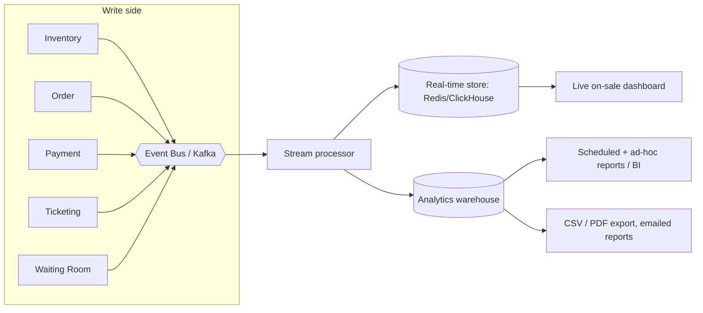

# Feature 5 — Reporting & Analytics

## Goal

Give organizers and platform admins accurate, timely insight — from a live
"how's the on-sale going right now" view to end-of-event financial
reconciliation — **without ever adding load to the selling path**.

## The core principle: never query the write store for reports

Selling is write-heavy and latency-critical. Reporting is read-heavy and
aggregation-heavy. Running reports against the transactional/inventory stores
would be the easiest way to slow down or crash an on-sale. So reporting lives on
a **completely separate read path** (CQRS), fed asynchronously from the event
bus.

## Two tiers of reporting

### 1. Real-time (the on-sale "war room")
Sub-second-to-seconds latency, for live decisions:
- Tickets sold / remaining, sell-through rate, revenue so far.
- Sales velocity (per minute), by section/tier/price.
- Queue size, admission rate, conversion (admitted → purchased).
- Payment success/decline rate (spot a PSP problem instantly).
- Geographic / channel breakdown.

Powered by a **stream processor** (Kafka Streams / Flink) maintaining rolling
aggregates in a fast store (Redis or ClickHouse), surfaced on the dashboard.

### 2. Analytical / historical
Minutes-fresh, for deeper analysis and finance:
- Full sales reports by any dimension, over any time range.
- **Financial reconciliation**: gross, fees, taxes, refunds, net payout per
  organizer/event.
- Refund/cancellation analysis, no-show vs scan rates.
- Cohort/marketing analysis, demand vs capacity, pricing performance.
- Fraud/chargeback reporting.

Powered by an **OLAP warehouse** (ClickHouse / Snowflake / Synapse), loaded from
the event stream (and periodic reconciliation batch jobs against the source of
truth for financial accuracy).

## Accuracy & reconciliation

- Streaming numbers are **eventually consistent** — fine for dashboards.
- **Financial reports are reconciled** against the transactional system of
  record (orders, payments, PSP settlement files) via scheduled batch jobs, so
  money numbers are exact and auditable, not just stream-derived.
- Every reported figure is traceable back to source events (the Kafka log is the
  audit trail).

## Delivery

- **In-dashboard** interactive views (organizer + admin).
- **Scheduled reports** emailed (daily sales, post-event summary).
- **On-demand export** to CSV/PDF/Excel.
- **Partner API** endpoints for programmatic report pulls.
- Optional **data export / warehouse share** for large organizers.

## Access control

- Organizers see only their own events; platform admins see global.
- All report access is authorized (RBAC) and audit-logged.
- PII in reports is minimized/masked per data-privacy rules.

## Recommended additions

- **Anomaly alerts**: auto-alert on payment decline spikes, sudden velocity
  drops (possible outage), or bot-like buying patterns.
- **Forecasting**: predicted sell-out time from current velocity.
- **A/B and pricing analytics** to inform dynamic pricing.
