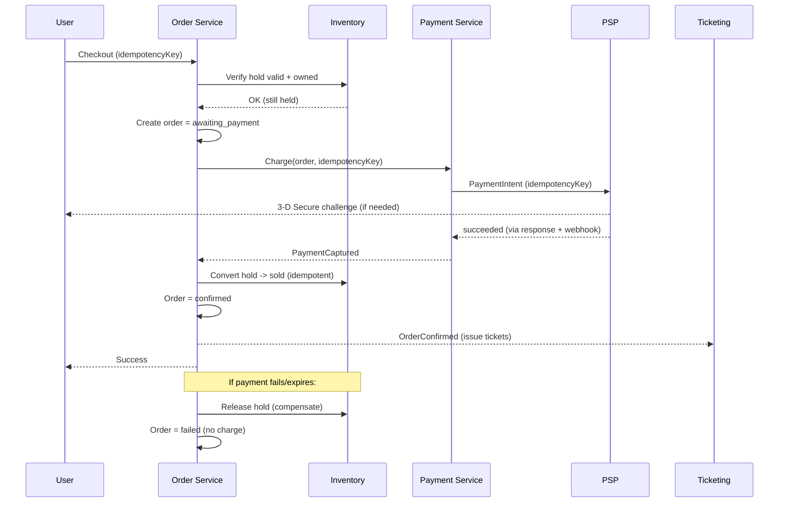

# Feature 6 — Payments

Payments are where "reliable" is non-negotiable. Two invariants dominate the
design: **never double-charge**, and **never confirm an order we didn't
actually get paid for** (and its mirror — never take money for a seat we can't
deliver). We achieve this with a **payment saga**, **idempotency everywhere**,
and **staying out of PCI scope**.

## PCI scope: stay SAQ-A

- Raw card data **never touches our servers**. We use the PSP's hosted
  fields / SDK (Stripe Elements, Adyen Components), so the browser sends card
  data directly to the PSP and we only ever handle a **token / payment intent
  id**.
- This keeps us at **PCI-DSS SAQ-A**, the lowest compliance burden, and
  eliminates the biggest class of breach risk. We never build our own PSP.

## The payment saga (happy path + compensation)

An order spans multiple services (inventory hold, order, payment, ticketing).
A distributed transaction across them isn't practical, so we use a **saga**:
a sequence of local transactions, each with a **compensating action** if a later
step fails.

## Idempotency (the anti-double-charge machinery)

- The client generates an **idempotency key** for the checkout and reuses it on
  every retry. The order service dedupes on it → one order max.
- The payment service passes an idempotency key to the **PSP** → the PSP dedupes
  the charge → one charge max, even if we call twice.
- The **convert-hold-to-sold** step is idempotent (keyed by order id) → safe to
  replay after any crash.
- **Webhooks are deduped** in an inbox table (keyed by PSP event id) → replays
  are harmless.

Result: any combination of user double-clicks, network retries, timeouts,
crashes, and webhook replays converges to **exactly one order, one charge, one
set of tickets**.

## Handling the hard cases

| Case | Handling |
|------|----------|
| **User double-submits** | Same idempotency key → single order/charge. |
| **We call PSP, network drops before response** | Retry with same idempotency key; PSP returns the original result — no second charge. |
| **PSP says success, our confirm crashes** | Saga re-runs from a durable state machine; convert-to-sold is idempotent; tickets still issue. |
| **Payment succeeds but hold expired meanwhile** | Guarded: we re-check hold before charging; if a race loses the seat post-charge (rare), **auto-refund** immediately and notify. Prefer to keep TTL > max payment time to avoid this. |
| **Payment fails / declined** | Release hold, order `failed`, invite retry (fresh attempt). |
| **3-D Secure / async methods** | Order sits `awaiting_payment`; confirmation arrives via webhook; TTL covers the wait. |
| **Duplicate webhook** | Inbox dedupe → no-op. |
| **Refund / cancellation** | Refund via PSP (idempotent), release/void inventory, revoke tickets, ledger entry. |
| **Event cancelled** | Bulk auto-refund job over all confirmed orders, idempotent per order. |

## Money movement & reconciliation

- Every payment/refund writes to an **append-only financial ledger** (double
  entry in spirit) — the audit source of truth.
- **Settlement files** from the PSP are reconciled daily against our ledger;
  discrepancies are alerted.
- **Payouts** to organizers via Stripe Connect / marketplace split, after fees.
- **Multi-currency**: price in the event's currency; PSP handles settlement FX;
  store amounts in minor units (integers) to avoid float errors.

## Fees, taxes, discounts

- Fees (service/booking) and **taxes** computed at checkout (tax provider for
  jurisdictions that need it), shown transparently before pay.
- Discount codes / access codes validated atomically (limited-use codes use the
  same atomic-counter approach as inventory to prevent over-redemption).

## Resilience

- **Timeouts + circuit breaker** around the PSP; **failover to a secondary
  PSP** on outage.
- If **all** PSPs are unavailable, **pause new checkouts** (organizer-visible)
  rather than take money we can't confirm — protecting the "never confirm
  unpaid" invariant.
- All payment state changes are events on the bus → real-time payment health on
  the reporting dashboard (spot a decline spike instantly).
